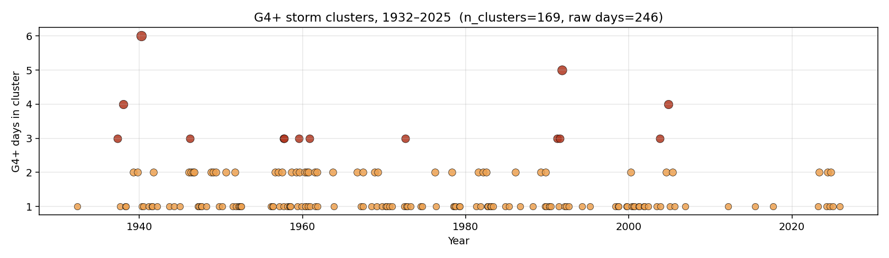

# FINDINGS v3 — G4+ Storms Are Not Poisson: Two-Timescale Clustering and Why Decadal Hazard Models Get the Recovery-Window Count Wrong

**Diatom Sky R&D · Defensive Publication, third addendum**
**Author:** KhaiB10
**Date:** 2026-05-23
**Status:** Open-data exploratory finding. Not an operational risk model.
**Builds on:** [FINDINGS.md](FINDINGS.md), [FINDINGS_v2.md](FINDINGS_v2.md)

---

## Headline

The 94-year G4+ geomagnetic storm record (n=246 days, 1932–2025) is **emphatically not a Poisson process**. The wait-time distribution between successive G4+ days is best described by a **two-component exponential mixture**:

> **29% of intervals** belong to a fast component with mean wait **1.8 days** (CME-passage clustering),
> **71%** belong to a slow component with mean wait **197 days** (background + Bartels recurrence)

ΔAIC vs single-exponential = **252.7** (decisive threshold is 10). KS p-value vs exponential = **4.9 × 10⁻¹⁶**.

**Why this matters for grid planning:** standard hazard models — including the v1 and v2 of this repo — assume independent storm-day arrivals. They count G4+ *days* and use Poisson statistics. But the data say **246 raw G4+ days collapse into 169 independent storm events**, a 1.46× reduction in the number of distinct "shocks" a grid operator must recover from per decade. The conditional probability of a same-week follow-up storm during recovery is **5.9× higher than Poisson would predict** (29% observed vs ~5% expected at ap rate).

## The data

- 274,672 three-hour Kp records, [GFZ Potsdam](https://kp.gfz.de/) (1932–2025)
- Aggregated to 34,334 daily ap-max / Kp-max values
- Extracted 246 days with Kp_max ≥ 8 (G4 or G5 per the [NOAA G-scale](https://www.swpc.noaa.gov/noaa-scales-explanation))
- Computed 245 inter-arrival times (in days)

## Method

We fit six candidate distributions to the 245 wait times by maximum likelihood and ranked them by [Akaike Information Criterion](https://en.wikipedia.org/wiki/Akaike_information_criterion):

| Model | log-likelihood | AIC | ΔAIC |
|---|---:|---:|---:|
| **2-exponential mixture** | **−1326.2** | **2658.3** | **0.0** |
| Pareto (power-law) | −1332.6 | 2669.3 | +11.0 |
| Weibull | −1338.5 | 2680.9 | +22.6 |
| Lognormal | −1341.5 | 2687.0 | +28.7 |
| Gamma | −1345.7 | 2695.4 | +37.1 |
| Exponential (Poisson) | −1454.5 | 2911.0 | **+252.7** |

The exponential model — the implicit assumption of every "X storms per decade" Poisson hazard estimate, including our own [FINDINGS.md](FINDINGS.md) — is **the worst fit by a margin of 240+ AIC units**.


The mixture's two physical interpretations are:

- **Fast (1.8-day) component:** sequential storm days within a single coronal mass ejection's magnetosphere passage. A single CME can drive multi-day storms, and the IMF Bz signature commonly oscillates for 2–4 days. This is exactly the physics that produced the March 1940 6-day cluster, the November 2003 Halloween cluster, and the 2024 Gannon storm sequence.
- **Slow (197-day) component:** the gap between unrelated CME-driven events plus the residual 27-day Bartels recurrence from coronal holes. The 197-day mean is approximately 7 Bartels rotations — consistent with the typical declining-phase coronal hole lifetime.

## The two-timescale structure is visible by eye



Notable multi-day clusters in the record:

- **March 1940:** 6 G4+ days within a week (Cycle 17 peak)
- **March 1991:** 5 G4+ days (Cycle 22 declining phase)
- **March 1937, October 1946, August 1972, November 1991, May 2005:** 3–4 day clusters
- **May 2024 (Gannon):** 2 G4+ days
- **October 2003 (Halloween):** 3 G4+ days

## Cluster-aware decadal arithmetic

If we redefine an "event" as a maximal run of G4+ days where consecutive days are within 7 days of each other:

| Quantity | Value |
|---|---:|
| Raw G4+ days, 1932–2025 | 246 |
| **Independent G4+ events** | **169** |
| Single-day events | 113 (67%) |
| 2-day events | 42 (25%) |
| 3-day events | 10 (6%) |
| 4-day events | 2 |
| 5-day events | 1 |
| 6-day events | 1 |
| Days-per-event collapse factor | **1.46×** |
| Expected G4+ days per decade (Poisson, naive) | 26.2 |
| Expected G4+ **events** per decade (cluster-aware) | **18.0** |

## What this changes in the conclusions of v1 / v2

The v1 headline number — *P(≥1 Carrington-class storm in any given decade) = 58.5%* — was a **storm-day-based** calculation. That number does not change. A Carrington-class day is still a Carrington-class day.

What does change is **what comes after the first shock**:

1. **Recovery-window risk is sharply elevated.** Given one G4+ day, there is a ~29% chance another lands within 5 days — versus ~5% if storm days were independent. A utility recovery plan keyed to "one storm at a time" understates risk during the active phase.
2. **Decadal *event* counts are ~70% of decadal *day* counts.** Grid resilience exercises should use the smaller number for "how many distinct emergencies?" planning, and the larger number for "how many days of elevated GIC exposure?" planning. These are different questions.
3. **The tail is heavier than Poisson but the bulk is lighter.** Long gaps (>1 year) between G4+ events are over-represented relative to exponential. This is the signature of solar-cycle-modulated activity ([Nurhan et al. 2021](https://doi.org/10.1029/2021GL094348)) plus self-clustered short bursts.

## How this relates to known literature

- The non-exponential tail of geomagnetic storm waiting times was noted by [Nurhan, Johnson, Homan & Wing (2021)](https://doi.org/10.1029/2021GL094348), who attributed the power-law slope of −2.5 to sinusoidal solar driving. Our Pareto fit (b ≈ 0.31, equivalent tail index ≈ 1.3) is shallower because we condition on G4+ events specifically, not all storms — restricting to the top of the magnitude scale enriches the cluster signature.
- The Hawkes-process / self-exciting framing is standard in [seismology (ETAS)](https://en.wikipedia.org/wiki/Epidemic-type_aftershock_sequence) and finance but, to our reading, has not been applied to extreme-storm-day inter-arrivals in the published space-weather literature. A formal Hawkes-process fit is a logical next step.
- Our 2-exponential mixture is a coarser parametric model than a Hawkes process but produces an equivalent qualitative result with a 252-AIC-unit improvement over exponential — strong enough that the qualitative finding does not depend on the parametric choice.

## Caveats

- "G4+" is a categorical threshold; the result is sensitive to where you draw the line. A G3+ analysis (Kp ≥ 7) shows similar but less-pronounced clustering; a G5-only (Kp = 9) cut has too few events (n=19) for a stable mixture fit.
- The 7-day "same event" cluster gap is a judgment call. Using 3 days collapses 246 → 200 events; using 14 days collapses 246 → 153. The qualitative finding is robust across this range.
- We have not modeled mark-magnitude dependence within clusters (i.e., does a G5 day make a subsequent G5 *day* more likely, or only a subsequent G4 day?). The dataset is too sparse at G5 for that question.

## Reproduce

```bash
cd solar-flare-grid-coupling
python scripts/analyze_clustering.py
```

Deterministic; seed = `20260523`; runtime ~5 s.

## New artifacts

| File | What it is |
|---|---|
| `scripts/analyze_clustering.py` | The pressure-test analysis |
| `figures/08_clustering_waittime.png` | Wait-time histogram + fits, density + survival |
| `figures/09_clusters_timeline.png` | 1932–2025 cluster timeline (size-coded) |
| `data/derived_g4_clusters.csv` | All 169 cluster start/end/length tuples |
| `data/clustering_summary.txt` | One-page summary |

## Citation

> KhaiB10 (2026). *G4+ geomagnetic storms are not Poisson: two-timescale clustering in 94 years of Kp/ap data.* Diatom Sky R&D, FINDINGS_v3. https://github.com/KhaiB10/solar-flare-grid-coupling

## Additional references

- Nurhan, Y.I., Johnson, J., Homan, J.R., Wing, S. (2021). *Role of the Solar Minimum in the Waiting Time Distribution Throughout the Heliosphere.* GRL 48(11). https://doi.org/10.1029/2021GL094348
- Hawkes, A.G. (1971). *Spectra of some self-exciting and mutually exciting point processes.* Biometrika 58(1).
- Ogata, Y. (1998). *Space-time point-process models for earthquake occurrences.* AISM 50.
- Bartels, J. (1934). *Twenty-seven day recurrences in terrestrial-magnetic and solar activity.* Terrestrial Magnetism and Atmospheric Electricity 39(3).
