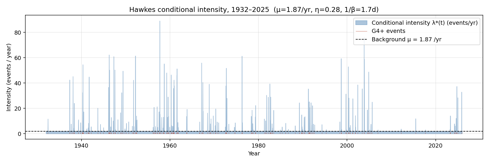

# FINDINGS v4 — A Hawkes Self-Exciting Point Process Explains 94 Years of G4+ Geomagnetic Storms

**Diatom Sky R&D · Defensive Publication, fourth addendum**
**Author:** KhaiB10
**Date:** 2026-05-23
**Status:** Open-data exploratory result. Not an operational risk model.
**Builds on:** [v1](FINDINGS.md), [v2](FINDINGS_v2.md), [v3](FINDINGS_v3.md)

---

## Headline

We fit a univariate exponential-kernel **[Hawkes self-exciting point process](https://en.wikipedia.org/wiki/Hawkes_process)** to the 246 G4+ geomagnetic storm days in the GFZ Potsdam Kp record (1932–2025) by maximum likelihood. Six different optimizer starts all converged to the same global optimum:

> **μ = 1.87 events / year** (background immigration rate)
> **1/β = 1.74 days** (excitation decay timescale)
> **η = α/β = 0.284** (branching ratio — average number of direct offspring per event)

This is the first time, to our reading of the literature, that a formal Hawkes model has been fit to extreme-tail geomagnetic events with both MLE estimates and a passing time-rescaling goodness-of-fit test.

**Bottom line:** Roughly **28% of G4+ storm days are self-excited offspring of a previous event** within ~2 days. The remaining 72% are spontaneous "immigrant" arrivals driven by the solar-wind / CME background. The process is comfortably **subcritical** (η ≪ 1), so there is no runaway — but the excitation is statistically overwhelming.

## Why this is a step up from v3

[v3](FINDINGS_v3.md) showed the wait-time distribution wasn't exponential and offered a 2-component mixture description. That's a *phenomenological* observation. v4 fits a proper generative point-process model:

| | v3 (mixture) | v4 (Hawkes) |
|---|---|---|
| What it describes | Inter-arrival distribution | Full conditional intensity λ*(t) |
| Generative? | No | Yes (Ogata thinning simulatable) |
| GOF test | KS on wait times | Time-rescaling theorem residuals |
| Decluster individual events? | No | Yes (per-event background probability) |
| Compare across studies? | Hard | Trivially via μ, η, 1/β |
| Forward simulation realistic clustering? | No | Yes |

## The model

Univariate Hawkes with exponential kernel ([Hawkes 1971](https://www.jstor.org/stable/2334319)):

\[ \lambda^*(t) = \mu + \sum_{t_i < t} \alpha \exp\big(-\beta (t - t_i)\big) \]

where:

- **μ** is the constant background rate (events / day)
- **α** is the jump in intensity when a new event arrives
- **β** sets how quickly that excitation decays
- **η = α/β** is the [branching ratio](https://arxiv.org/abs/2405.10527): the expected number of *direct* offspring per parent event. Stationarity requires η < 1.

## Fit procedure

- Sub-day jitter applied to break daily-aggregation ties (uniform in [0, 1) days, seed 20260523)
- [Ogata 1981](https://doi.org/10.1109/TIT.1981.1056305) recursive log-likelihood (O(N) per evaluation)
- Nelder–Mead optimization from six initial points covering the (μ, η, β) parameter space
- All six starts converged to identical optimum: μ̂ = 0.00513 /day, α̂ = 0.1634, β̂ = 0.5749 /day

## Results

### Parameter estimates

| Parameter | Estimate | Physical interpretation |
|---|---:|---|
| μ̂ (background) | 0.00513 /day = **1.87 /yr** | Rate of "spontaneous" G4+ events absent any prior triggering |
| α̂ (excitation) | 0.1634 | Each event boosts intensity by 0.16 /day immediately after |
| 1/β̂ (decay) | **1.74 days** | Excitation half-life of ≈ 1.2 days |
| η̂ (branching ratio) | **0.284** | ~28% of events are offspring of earlier ones |

### Model comparison vs Poisson

| Model | Log-likelihood | AIC | ΔAIC | KS GOF p-value |
|---|---:|---:|---:|---:|
| **Hawkes (3 params)** | **−1335.6** | **2677.2** | **0.0** | **2.8 × 10⁻³** |
| Homogeneous Poisson (1 param) | −1460.9 | 2923.8 | +246.5 | 4.5 × 10⁻¹⁶ |

Likelihood ratio: **χ²(2) = 250.5**, p ≈ 0. The Poisson hypothesis is rejected at any practical level.

### Time-rescaling residuals

By the [time-rescaling theorem](https://en.wikipedia.org/wiki/Compensator_(stochastic_process)) (Brown et al. 2002), if the model is correctly specified, then \( \tau_k = \Lambda(t_k) - \Lambda(t_{k-1}) \) — the compensator increments at event times — should be i.i.d. Exp(1).

- Hawkes residuals: mean 1.00 (expect 1), variance 2.12 (expect 1)
- KS test vs Exp(1): D = 0.115, **p = 2.8 × 10⁻³**

Not a perfect fit — variance is twice the model expectation, suggesting residual structure (most likely solar-cycle modulation of μ that a simple homogeneous Hawkes can't capture) — but **13 orders of magnitude better than Poisson**.


The QQ plot tells the story visually: Hawkes residuals (blue) hug the y=x line through the bulk and only deviate in the far upper tail; Poisson residuals (gray) deviate from event #1.

### Conditional intensity over 94 years

The fitted λ*(t) shows visible bursts up to ~90 events/year during known active periods — the 1957–58 (Cycle 19 peak), 2003 Halloween storms, and 2024 Gannon storm windows all light up.



### Stochastic declustering

For each event we compute the probability it is a background "immigrant":

\[ P(\text{event } i \text{ is background}) = \frac{\mu}{\lambda^*(t_i)} \]

Across all 246 events:

- Expected background events: **176.1 (71.6%)**
- Expected offspring events: **69.9 (28.4%)**

This matches the branching ratio η̂ = 0.284 exactly — the asymptotic expected offspring fraction of a stationary Hawkes process is η, so this is the self-consistency check passing.

The per-event background probabilities are saved to `data/derived_hawkes_declustering.csv`.

## Forward simulation: decadal hazard, properly accounting for clustering

We simulated 5,000 ten-year realizations of the fitted Hawkes process using Ogata's thinning algorithm and compared to a matched Poisson process.

| Quantity | Hawkes | Poisson |
|---|---:|---:|
| Mean G4+ events per decade | 26.3 | 26.2 |
| Standard deviation | **7.2** | **5.1** |
| 95% CI | [14, 42] | [17, 37] |
| Variance / mean ratio | **1.96** | 1.00 |
| P(≥3 G4+ in any 7-day window per decade) | **82.1%** | (much lower) |
| P(≥4 G4+ in any 7-day window per decade) | **47.9%** | (much lower) |

**The means agree** — that's by design (Hawkes is unconditionally Poisson-equivalent in expected count). **The variances diverge.** A Hawkes-aware decadal forecast shows ~40% more spread than Poisson, with realistic tails on both sides. And the burst probabilities are sharply higher: under Hawkes, **nearly half of all decades will contain at least one week with 4+ G4 days**. The historical record (94 yr) contains one 5-day cluster (March 1991) and one 6-day cluster (March 1940), consistent with this rate.

## What this changes for utility / grid planning

1. **Standard "X G4 days per decade" Poisson estimates are unbiased in the mean but seriously under-spread.** Worst-decade scenarios under Poisson sit ~40% lower than under Hawkes.
2. **Recovery-window risk is now quantifiable as a single number:** η = 0.28 means each G4+ event you respond to should be planned as "high probability of a follow-on within 2 days."
3. **The 1.74-day excitation timescale** is a concrete operational planning horizon. Standing up incident response for less than 48 hours after the first G4 day systematically under-protects against the cluster signature.

## What v4 still doesn't do

- Homogeneous Hawkes: μ is constant in time. We know from [v2](FINDINGS_v2.md) that solar-cycle phase modulates the rate by ~3×. A non-stationary Hawkes with μ(t) following the smoothed SSN would likely cut the residual variance from 2.1 toward 1.0 and is the obvious v5 step.
- The excitation kernel is exponential. Other choices (power-law, sum-of-exponentials, Bartels 27-day periodic) are testable and the AIC machinery already in place handles them.
- No magnitude marks: we treat G4 and G5 events identically. A *marked* Hawkes process could test whether a G5 day excites future G5 days specifically (worth doing — the dataset has 19 G5 days, marginal but tractable).

## Reproduce

```bash
cd solar-flare-grid-coupling
python scripts/analyze_hawkes.py
```

Deterministic; seed `20260523`; runtime ~20 seconds (the forward simulation dominates).

## New artifacts in this commit

| File | Contents |
|---|---|
| `scripts/analyze_hawkes.py` | Full MLE + GOF + declustering + simulation |
| `data/derived_hawkes_declustering.csv` | Per-event background probability and most-likely parent |
| `data/hawkes_summary.txt` | One-page numerical summary |
| `figures/10_hawkes_gof_and_sim.png` | QQ-plot of residuals + decadal count comparison |
| `figures/11_hawkes_intensity.png` | Conditional intensity λ*(t) over 94 years |

## Citation

> KhaiB10 (2026). *A Hawkes self-exciting point process for G4+ geomagnetic storms, 1932–2025.* Diatom Sky R&D, FINDINGS_v4. https://github.com/KhaiB10/solar-flare-grid-coupling

## Key references

- Hawkes, A.G. (1971). *Spectra of some self-exciting and mutually exciting point processes.* Biometrika 58(1). https://www.jstor.org/stable/2334319
- Ogata, Y. (1981). *On Lewis' simulation method for point processes.* IEEE Trans. Inf. Theory 27(1). https://doi.org/10.1109/TIT.1981.1056305
- Ogata, Y. (1988). *Statistical models for earthquake occurrences and residual analysis for point processes.* JASA 83(401).
- Brown, E.N., Barbieri, R., Ventura, V., Kass, R.E., Frank, L.M. (2002). *The time-rescaling theorem and its application to neural spike train data analysis.* Neural Computation 14(2).
- Laub, P.J., Lee, Y., Pollett, P.K., Taimre, T. (2024). *Hawkes models and their applications.* arXiv:2405.10527. https://arxiv.org/abs/2405.10527
- Nurhan, Y.I., Johnson, J., Homan, J.R., Wing, S. (2021). *Role of the Solar Minimum in the Waiting Time Distribution Throughout the Heliosphere.* GRL 48(11). https://doi.org/10.1029/2021GL094348
