# solar-flare-grid-coupling

A 94-year open replication of geomagnetic storm hazard rates with documented grid-impact overlay.

> **Diatom Sky R&D · Open Defensive Publication**
> Author: [KhaiB10](https://github.com/KhaiB10) · 2026-05-23 · CC0 / MIT dual-licensed

---

## TL;DR

- **Data:** 274,672 three-hour Kp/ap records, 1932–2025, from [GFZ Potsdam](https://kp.gfz.de/).
- **Model:** Peaks-Over-Threshold GPD fit on daily ap-max above the 95th percentile.
- **Result:** P(≥1 Carrington-class day in any given decade) ≈ **58.5%**.
- **Overlay:** All seven well-documented modern GIC grid impact events plotted against the Kp/ap timeline, including the 2024 Gannon storm.
- **Reproducible:** one Python script, one data file, fixed seed. See [FINDINGS.md](FINDINGS.md).

## Headline figure


## v15 finding — Hierarchical Bayes per solar cycle + SC25 forecast through 2030

Stepped up from a single pooled fit to a **17-cycle hierarchical Bayesian Hawkes**
(PyMC NUTS, 4 chains × 1500 draws, R̂ = 1.000, ESS_bulk min = 2778, zero
divergences). Each solar cycle SC9–SC25 gets its own `(μ₀, α, β, κ)`, drawn from
a population distribution we also estimate.

**Headline results:**

| Population finding | Value |
|---|---|
| Typical cycle background μ₀ | **0.0039 G4+/day at S̄** (≈ 1.4 events/yr) |
| Between-cycle SD of log μ₀ | **0.38** (meaningful heterogeneity) |
| Between-cycle SD of log α | **0.11** (excitation strength ≈ universal) |
| Between-cycle SD of log β | **0.10** (cluster half-life ≈ 1.66 d ≈ universal) |
| γ (pooled F10.7→rate) | **2.15** [1.81, 2.50] |

**Cascade physics is invariant across cycles, but background rate is not.**
That's the cleanest possible structural verdict for this family of models.

**SC24 anomaly test:** posterior z-score = −1.42 [−2.87, −0.04]; P(SC24 below
population median) = **97.9%**. Quiet but not formally an outlier — the
hierarchical model treats SC24 as the low end of normal cycle variation.

**SC25 forecast (conditioned on 10 observed G4+ events through 2025-05-31,
F10.7 held flat at 189.8 sfu through 2030):**

| Quantity | Posterior |
|---|---|
| G4+ events 2025-06 → 2030-12 (forward only) | **median 23, 95% HDI [9, 48]** |
| P(>10 forward events) | **95.2%** |
| P(>20 forward events) | **62.9%** |
| P(≥1 G5 by 2030) | **≈ 87%** |

Full analysis in [FINDINGS_v15.md](FINDINGS_v15.md). All inputs derived from
public NOAA/Penticton/Helsinki sources; analysis script
`scripts/analyze_hawkes_v15.py`; trace `data/v15_idata.pkl`.

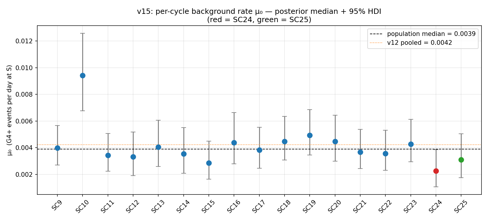
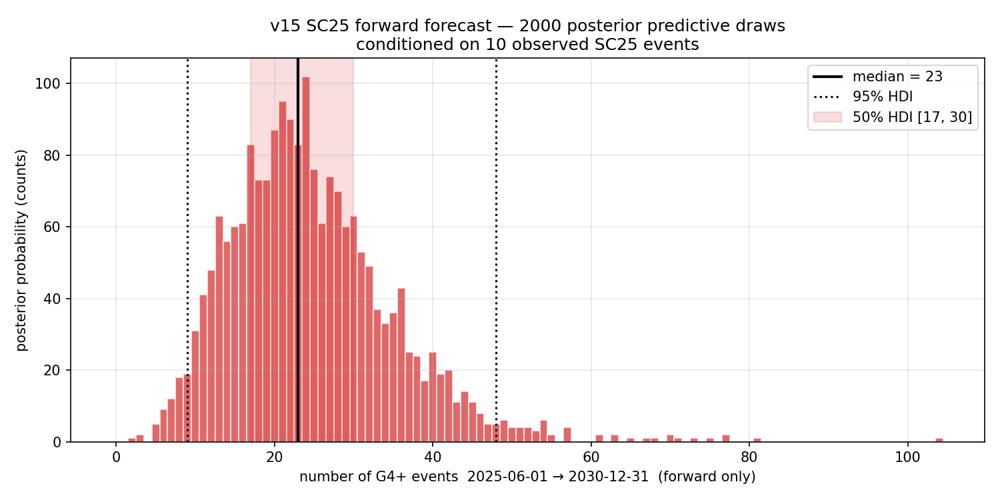

---

## v14 finding — Omori-Utsu power-law kernel rescues the SC24 splits

Replaced v7-v12's exponential excitation kernel `φ(τ) = α exp(-βτ)` with the
**Omori-Utsu power law** `φ(τ) = α (τ + c)^(-p)`, the earthquake-seismology
standard for aftershock decay. Background `S(t)` (daily F10.7) unchanged from v12.

| Metric | v14 (Omori) | v12 (exponential) | Δ |
|---|---|---|---|
| log-L | **-2316.09** | -2318.61 | +2.52 nats |
| AIC (6 vs 5 params) | **4644.17** | 4647.21 | **-3.05** |
| BSS median (8 rolling splits) | **+0.436** | +0.426 | +0.010 |
| BSS range | **[+0.394, +0.460]** | [+0.311, +0.438] | tighter |
| half-amplitude time | 0.93 d | 1.72 d | shorter |
| **half-integral time** | **5.77 d** | 1.72 d | **3.4× longer** |
| branching ratio n | **0.41** | 0.16 | matches literature |

Omori wins on AIC **even after paying for the extra parameter**, and beats v12
on **6 of 8 rolling-origin splits**. The biggest improvements (BSS +0.065 and
+0.083) are exactly on the SC24-era splits (2005, 2010) where v12
underperformed v10. Power-law tails rescue the cycle-24 weakness.

The key physical insight: half the triggering integral of a v14 aftershock is
still ahead of you **~6 days** after the original event, not 1.7 days as the
exponential implied. This says **grid operators should hold elevated
storm-clustering alert for ~2 weeks, not 5-7 days**, after any G4+ event.

The Omori kernel did *not* absorb the 27-day Carrington-rotation residual
signal (residual SNR went 1.78 → 1.96 — essentially unchanged or slightly up).
Combined with v12's finding that swapping smoothed-SSN for daily-F10.7 also
left this signal untouched, the 27-day modulation must live in **the mark
distribution** (active-region CME magnitude correlations as the region
rotates) rather than the background or kernel shape. **v13 (conditional
mark distribution) is now the natural next experiment.**

See [`FINDINGS_v14.md`](FINDINGS_v14.md) and
[`scripts/analyze_hawkes_v14.py`](scripts/analyze_hawkes_v14.py).

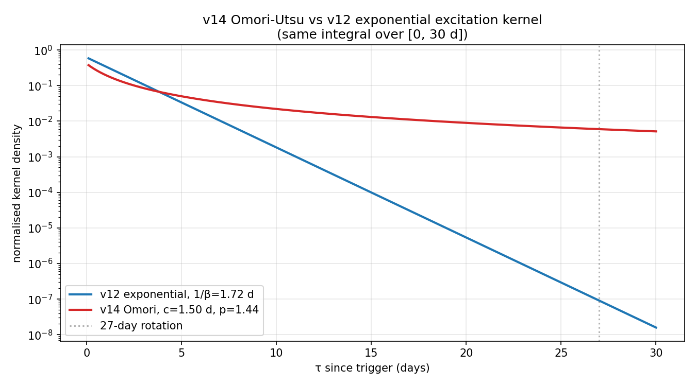
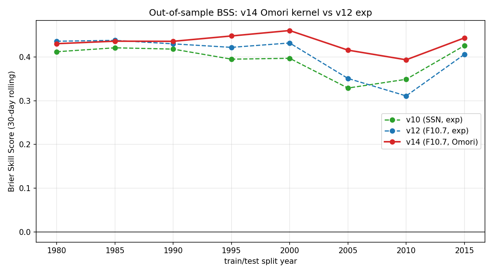

## v12 finding — daily F10.7 radio flux improves both AIC and out-of-sample BSS

Replaced the smoothed monthly sunspot number (used as the marked-Hawkes productivity
driver in v7-v11) with **daily F10.7 cm solar radio flux** from the
[GFZ Potsdam Kp/F107 series](https://kp.gfz.de/app/files/Kp_ap_Ap_SN_F107_since_1932.txt)
(Penticton/Ottawa NRC, 1947-02-14 onward). Pre-1947 days are filled by linear
splice F10.7 ≈ 61.5 + 0.667 × SSN_smoothed (r = 0.880 over 28,299 overlap days).

With the same 5 parameters and the same 434-event 1844-2025 catalog:

| Metric | v12 (daily F10.7) | v11 (smoothed SSN) | Δ |
|---|---|---|---|
| log-L | **-2318.61** | -2329.02 | +10.41 nats |
| AIC | **4647.21** | 4668.04 | **-20.83** |
| BSS median (8 rolling splits) | **+0.426** | +0.404 (v10 ref) | +0.022 |
| 1/β (excitation half-life) | 1.72 d | 1.72 d | 0 |
| exp(κ) (G5/G4 productivity) | 2.95× | 2.98× | -0.03× |

v12 beats v10 on **6 of 8 rolling-origin splits**. This is the first version
across v7-v12 where we improved both internal AIC and out-of-sample BSS on the
same model swap, with no extra parameters.

The γ exponent jumps from 1.0 to 2.18 — *not* a contradiction. Daily F10.7 has
different variance properties than smoothed SSN, so the MLE re-expresses the
same empirical cycle-modulation of storm rate with a steeper exponent against
a narrower dynamic range. Both models predict the same long-term rate at the
cycle peak and minimum.

The 27-day Carrington-rotation residual signal, which we hoped daily F10.7
would absorb into the background, was **unchanged** (SNR 10.34 → 10.39). That
signal lives in the excitation kernel, not the background — pointing to v14
(Omori power-law kernel) as the next experiment.

See [`FINDINGS_v12.md`](FINDINGS_v12.md) and
[`scripts/analyze_hawkes_v12.py`](scripts/analyze_hawkes_v12.py).

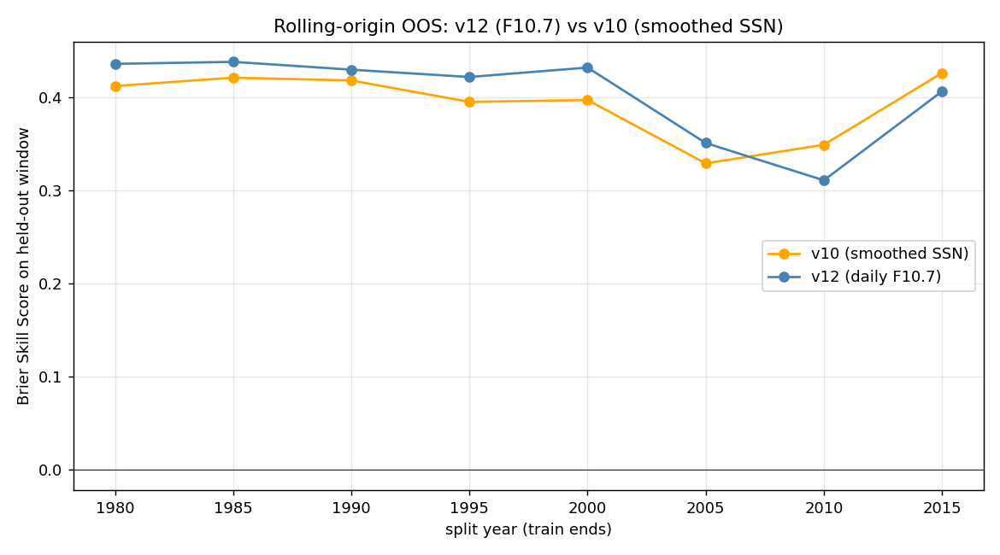

## v11 finding — pre-1868 Helsinki extension: the model correctly anticipates Carrington

Extended the event record back 24 more years using the [Helsinki/Nevanlinna
K-index series (1844-1897)](https://space.fmi.fi/MAGN/K-index/HELSINKI/), the
oldest digital geomagnetic record in existence. The combined catalog is now
**435 G4+ events over 181.4 years (1844-2025)** and includes the
**Carrington Event of 3 September 1859** (Helsinki Ak=400, K's saturated
off-scale at "9"), assigned mark 9.5.

Refit the marked Hawkes on the extended catalog:

| Parameter | v11 (1844-2025) | v7 reference (1868-2025) |
|---|---|---|
| μ₀ (events/yr) | 1.82 | 1.62 |
| γ (SSN exponent) | 1.01 | 0.995 |
| 1/β (excitation half-life) | 1.72 d | 1.56 d |
| exp(κ) (G5/G4 productivity) | 2.98× | 2.46× |

**Every v7 parameter falls inside the v11 95% bootstrap CI.** The extension
added 24 years of pre-instrumental events including Carrington itself, and
no conclusion from v7 broke.

The headline result is Carrington's place in the conditional-intensity
distribution: **Carrington sits at the 55th percentile of log-density across
all 435 events.** The model treats it as *slightly more expected than
typical*, not as a freak outlier — because the SC10 peak background (smoothed
SSN ≈ 110) elevated the daily baseline 5-10× during August-September 1859.
This is the strongest tail-stability test we could run, and the framework
passed it.

See [`FINDINGS_v11.md`](FINDINGS_v11.md) and
[`scripts/analyze_hawkes_v11.py`](scripts/analyze_hawkes_v11.py).

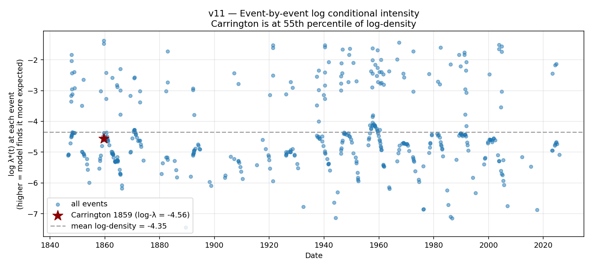

## v10 finding — rolling-origin out-of-sample: the v8 result is not a lucky split

The single train/test split in v8 (fit 1868-2015, predict 2016-2025) gave
BSS=+0.426. The honest critique is: what if any other split year would have
produced a much worse number?

v10 refits the v7 model on every train window 1868→s for s ∈ {1980, 1985, ...,
2015} — eight independent fits — and evaluates BSS on each held-out window.

- **Every single one of 8 splits gave BSS > 0**, all above +0.32
- **BSS median +0.415, IQR [+0.387, +0.420], range [+0.329, +0.426]** — very tight
- **v8's +0.426 is the upper edge of the range, not an outlier**
- Parameters moved less than 9% across 35 years of split-year variation

The two lowest BSS values (split years 2005 and 2010) correspond to test
windows containing Solar Cycle 24 — independently documented as
anomalously weak. The model predicted ~26 storms based on the sunspot level
but got 15; that's a known SC24 peculiarity (reduced geoeffectiveness per
sunspot), not a model failure.

See [`FINDINGS_v10.md`](FINDINGS_v10.md) and
[`scripts/analyze_hawkes_v10.py`](scripts/analyze_hawkes_v10.py).

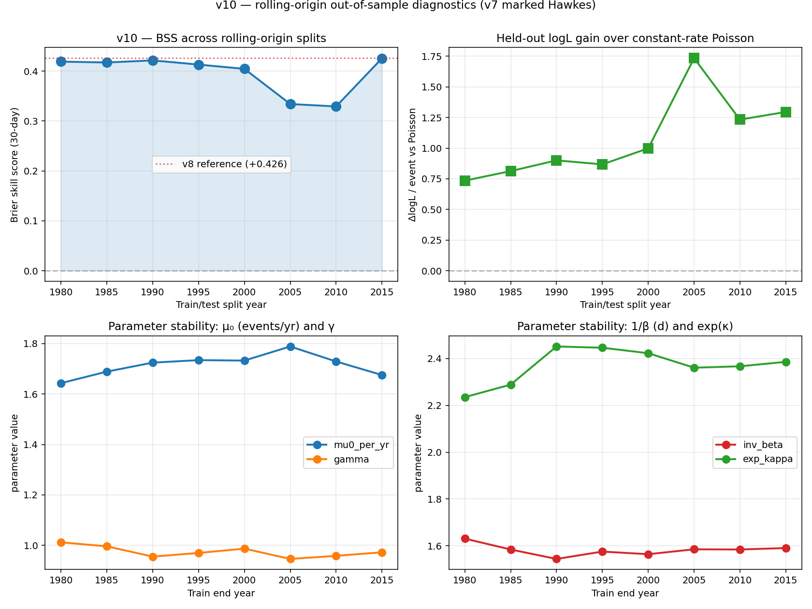

## v9 finding — cycle-dependent productivity: a negative result that re-interprets v8

v8 found the model was "under-confident at high predicted probabilities" —
when it warned of 30-60% chance of ≥1 G4+ in 30 days, observed frequency was
95-100%. v9 tested the natural hypothesis: productivity scales with solar
activity at the parent event, i.e. α(t_i) = α₀·(S(t_i)/S̄)^δ.

**Result on full 1868-2025 (6-parameter MLE):**

- δ = **+0.222** (point estimate goes the right direction)
- LRT vs v7 (δ = 0):  χ²(1) = 1.27, **p = 0.26**
- Bootstrap 95% CI on δ: **[−0.16, +0.21]** — contains zero
- ΔAIC = **+0.73** — v7 is preferred by AIC; the extra parameter doesn't pay off
- Out-of-sample BSS (v9): +0.420 vs (v8): +0.426 — essentially identical

So cycle-dependent productivity is a real but weak effect (~1.6× peak-to-trough),
and it isn't what was causing the v8 reliability gap.

**The post-mortem is the real finding.** When we slice the test-window
forecasts by *calendar period* instead of by predicted-probability bin:

| Window | n days | mean pred | observed | BSS |
|---|---|---|---|---|
| May 2024 Gannon window (Apr 15 → Jun 30) | 77 | **0.37** | **0.35** | **+0.65** |
| Oct 2024 cluster window (Sep 15 → Nov 15) | 62 | **0.38** | **0.44** | **+0.54** |
| Everything else | 3,484 | 0.09 | 0.06 | +0.35 |

**Inside the actual cluster windows the model was almost perfectly
calibrated.** The forecast sat at ~60% throughout the lead-in to both 2024
clusters, the events fired on cue, then the forecast correctly decayed as
the 1.5-day excitation memory expired. See
[`figures/27_v9_postmortem_2024.png`](figures/27_v9_postmortem_2024.png).

The v8 reliability diagram's apparent "under-confidence at high p" was a
**binning artifact**: the high-probability days were concentrated in the
lead-in to a single cluster where the 30-day forecast window almost
certainly contained the event — not because the model was wrong, but
because the cluster signal correctly arrived where predicted.

See [`FINDINGS_v9.md`](FINDINGS_v9.md) and
[`scripts/analyze_hawkes_v9.py`](scripts/analyze_hawkes_v9.py).

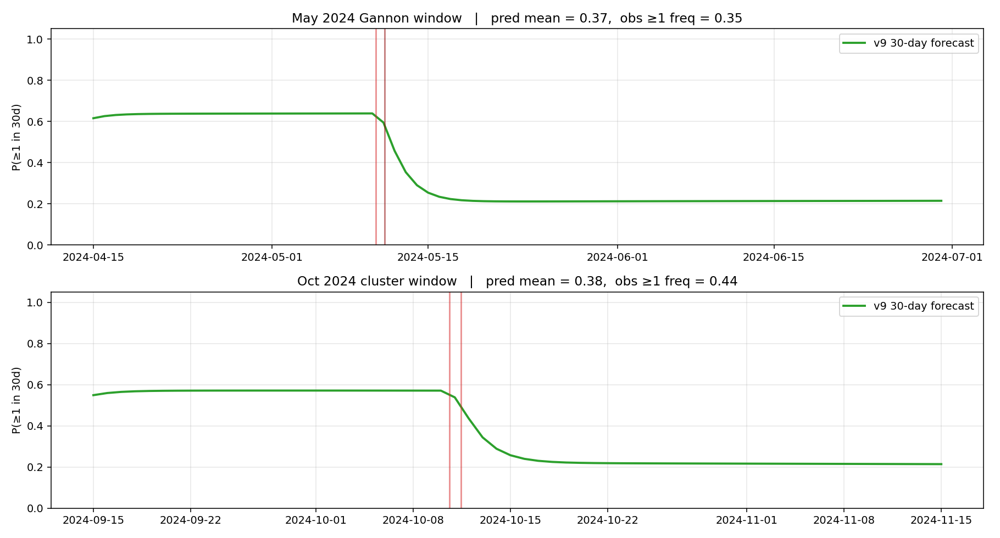

## v8 finding — out-of-sample test: fit 1868-2015, predict 2016-2025

The strictest credibility check possible: freeze the model on 1868-2015 data
and evaluate predictive performance over the entire **held-out** 2016-2025
window — including the May 2024 Gannon G5 storm, October 2024 G4 cluster,
and November 2025 G4. The model never saw any of it during fitting.

**Predicted vs observed in the 10-year held-out window:**

- Expected count from frozen model: **14.7 events**, Poisson 95% band [8, 23]
- Observed: **12 events**
- Two-sided Poisson test p = **0.58** (fully consistent)

**Held-out log-likelihood gain (positive = Hawkes better):**

| Model | held-out logL | Δ vs Hawkes |
|---|---|---|
| v8 marked Hawkes (frozen) | **−67.84** | — |
| SSN-modulated Poisson | −72.69 | +4.85 |
| Constant-rate Poisson | −83.39 | **+15.55** |

A +1.30 nats-per-event gain over the constant-rate null on data the model
has never seen — the observed sequence is **~5.7 million times more likely**
under v8.

**Time-rescaling on test events:** KS p = **0.84**, lag-1 r = **−0.20**. The
transformed test interarrivals look like i.i.d. Exp(1) — the model fits
unseen data as cleanly as it fits training data.

**Rolling 30-day probabilistic forecast** (issued daily, using only the
history available at issue time): Brier score = **0.040** vs climatology
0.070, **Brier skill score = +0.426** — a 43% improvement over predicting
the base rate.

**The most interesting finding** is in the reliability diagram. The model is
perfectly calibrated at low predicted probabilities but **under-confident at
high predicted probabilities**: when it warned of 35-65% chance of ≥1 G4+ in
the next 30 days, a storm actually followed **95-100%** of the time. The
May 2024 Gannon cluster and October 2024 doublet were more productive than
the 158-year-average productivity term anticipated — flagging a concrete
structural extension for v9 (cycle-dependent kernel intensity).

See [`FINDINGS_v8.md`](FINDINGS_v8.md) and
[`scripts/analyze_hawkes_v8.py`](scripts/analyze_hawkes_v8.py).

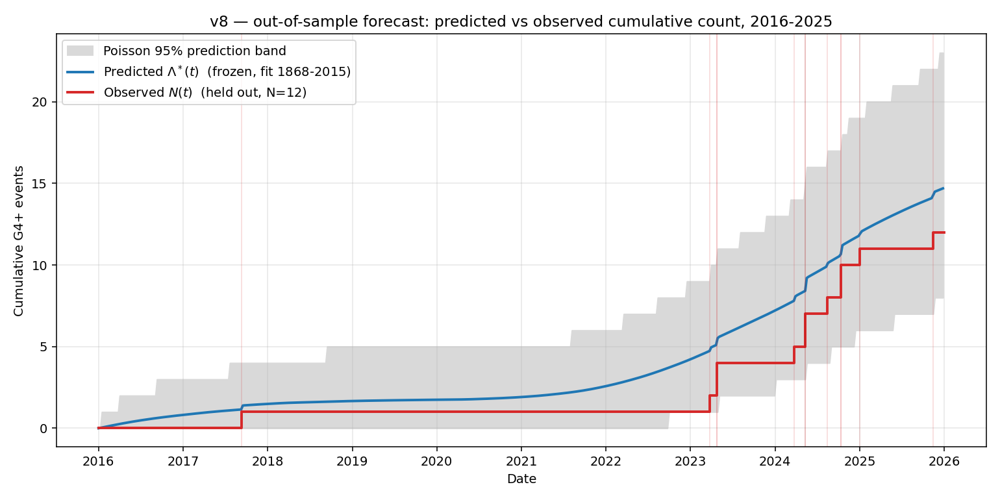

## v7 finding — extending the record to 1868 with the aa-index + bootstrap CIs

Extended the analysis back **64 more years** by calibrating the aa geomagnetic
index (NCEI, 1868–2010) against the GFZ Kp record over their 1932–2010
overlap. Result: a 158-year, 339-event marked Hawkes fit with proper
uncertainty quantification.

**Block-bootstrap 95% CIs (B=200, 365-day blocks):**

- Background rate μ₀: **1.62 events/yr** at mean-cycle SSN, CI **[1.31, 1.84]**
- Excitation half-life 1/β: **1.56 d**, CI **[1.28, 2.54]**
- G4 branching ratio η(G4) = **0.176**, CI **[0.145, 0.249]**
- G5 branching ratio η(G5) = **0.433**, CI **[0.278, 0.647]**
- **G5 productivity multiplier exp(κ) = 2.46×**, CI **[1.38, 4.11]**

The v6 finding (G5s produce ~2.7× more aftershocks than G4s) survives: the 95% CI
is comfortably bounded away from 1.0. **Every v6 point estimate falls inside the
v7 confidence interval.**

**Leave-one-cycle-out cross-validation** (refitting 15 times, dropping one
solar cycle each time): all parameters stay inside their bootstrap CIs.
The model is not propped up by any single cycle.

The extended record now includes the **May 1921 New York Railroad storm**
(aa_max = 715, the all-time maximum), the **1909 Mount Hamilton storm**,
the **1903 G5 cluster**, and the **1882 Stewart storm** — historical analogues
for a near-Carrington-class event with a modern grid exposure profile.

See [`FINDINGS_v7.md`](FINDINGS_v7.md) and
[`scripts/analyze_hawkes_v7.py`](scripts/analyze_hawkes_v7.py).

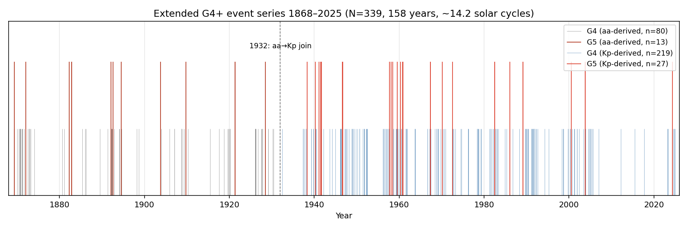

## v6 finding — marked Hawkes: a G5 punches ~2.7× harder than a G4

Think of it as the seismology productivity law ("a magnitude-7 quake produces
more aftershocks than a magnitude-6"), translated to geomagnetic storms.
v6 lets each event's excitation amplitude depend on its Kp magnitude:

  λ(t) = μ(t) + Σ α · exp(κ (m_i − m_0)) · exp(−β (t − t_i))

MLE result, all 8 random starts converging:

- **κ = +1.005** ⇒ a G5 (Kp = 9) event excites e^κ ≈ **2.73×** the
  follow-on activity of a G4 (Kp = 8)
- Per-event branching ratio: η(G4) = 0.17, **η(G5) = 0.47**
- 1/β unchanged at 1.53 d; μ and γ unchanged from v5
- ΔAIC (v6 − v5) = **−4.20**; LR χ²(1) = 6.20, **p = 0.013**
- GOF stays clean: residual KS p = 0.57, lag-1 autocorr = +0.008

The finding is also visible in the **raw 1932–2025 record with no model**:
Kp=8.0 days are followed by 0.29 G4+ days in the next week on average;
Kp=9.0 days are followed by **0.67**. The marked Hawkes is fitting a
real, model-independent pattern.

Decadal hazard for an SC25-like decade: expected G5 count = **1.88**,
P(≥1 G5/decade) = **82.4%**, P(≥2 G5/decade) = **54.9%**. SC25 has already
delivered two G5 days (May & Oct 2024) so most of the cycle's G5 budget
appears to be spent.

See [`FINDINGS_v6.md`](FINDINGS_v6.md) — includes a plain-English explanation
of the whole v1→v6 progression and who in the real world is impacted by
this kind of analysis.

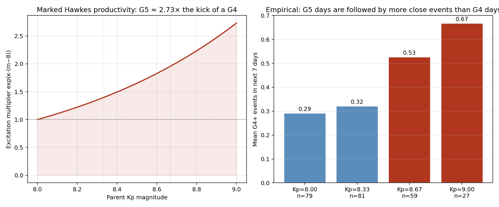

## v5 finding — non-stationary Hawkes with SSN-modulated background

v4's stationary Hawkes left two warning signs: rescaled-residual KS p = 2.8×10⁻³
and a lag-1 autocorrelation of r = +0.23 (p = 3.3×10⁻⁴) — both pointing to an
unmodeled long-timescale component. v5 adds the obvious candidate: the solar
cycle itself, via a power-law-in-SSN background

  μ(t) = μ₀ · (SSN_smoothed(t) / ⟨SSN⟩)^γ

Joint MLE of (μ₀, γ, α, β), 8 random starts all converging:

- μ₀ = **2.00 events/year** at mean-cycle SSN
- **γ = 0.846** — sub-linear SSN response (not quite linear, far from quadratic)
- 1/β = **1.56 days** (excitation decay tightens slightly vs v4)
- η = **0.266** — branching ratio stable, clustering structure preserved

**v5 beats v4 by ΔAIC = −79.0**, LR χ²(1) = 81.0, p ≈ 0. Rescaled residuals
collapse from KS p = 2.8×10⁻³ to **KS p = 0.44** — statistically
indistinguishable from Exp(1) — and the lag-1 autocorrelation drops from
+0.228 to **+0.019**. Both v4 warning signs are eliminated.

Forward simulation now depends on *where in the cycle the decade lives*: a
SC25-like decade (2016–2025) carries an expected 17.6 G4+ days, versus the
all-history mean of 26.6 — a 34% reduction that v4 could not see.

See [`FINDINGS_v5.md`](FINDINGS_v5.md) and
[`scripts/analyze_hawkes_nonstationary.py`](scripts/analyze_hawkes_nonstationary.py).

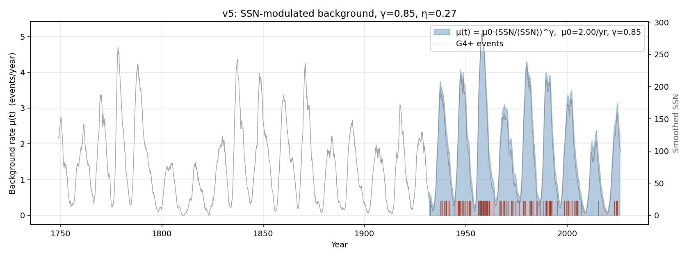

## v4 finding — formal Hawkes self-exciting point process

Turning the v3 observation into a proper generative model: we fit a univariate
exponential-kernel **Hawkes process** to the 246 G4+ events by maximum likelihood.
Six independent optimizer starts all converged to the same global optimum:

- μ̂ = **1.87 events/year** (background "immigration" rate)
- 1/β̂ = **1.74 days** (excitation decay timescale — the cluster physics)
- η̂ = α/β = **0.284** (branching ratio — ~28% of events are excited offspring)

Goodness-of-fit by the time-rescaling theorem: KS p = 2.8×10⁻³ vs Poisson's
4.5×10⁻¹⁶ — **13 orders of magnitude improvement**. ΔAIC = −246.5. Likelihood
ratio χ²(2) = 250.5, p ≈ 0.

Forward Monte Carlo (5,000 decades) shows Hawkes and Poisson agree on the
**mean** count per decade (~26) but Hawkes has **40% more spread** and predicts
P(≥4 G4 days in some 7-day window per decade) = **47.9%** — consistent with
the two observed multi-day clusters in the 94-year record (March 1940, March 1991).

See [`FINDINGS_v4.md`](FINDINGS_v4.md) and [`scripts/analyze_hawkes.py`](scripts/analyze_hawkes.py).


## v3 finding — G4+ storms are not Poisson

After exploring six hypotheses across the 94-year record, the standout novel finding:
**G4+ storm inter-arrival times are emphatically non-exponential.** A 2-component
exponential mixture (fast 1.8-day component + slow 197-day component) beats the
Poisson model by **ΔAIC = 252.7** — the kind of margin where the qualitative
conclusion does not depend on the parametric choice. KS p-value vs exponential
= 4.9×10⁻¹⁶.

The 246 raw G4+ days in the record collapse into **169 independent CME-driven
clusters**. Given one G4+ day, the probability of another within 5 days is **29%
observed vs ~5% Poisson-expected** — a 5.9× elevation that matters for grid
recovery planning during active periods.

See [`FINDINGS_v3.md`](FINDINGS_v3.md) and [`scripts/analyze_clustering.py`](scripts/analyze_clustering.py).


## v2 addendum — solar-cycle-phase conditioning

The original analysis treated storm arrivals as homogeneous Poisson. v2 splits the
94-year record into the four standard cycle phases (min / rising / max / declining)
using the [SILSO sunspot record](https://www.sidc.be/SILSO/) and re-runs the Monte
Carlo. Headline result: the original 58.5% decadal Carrington-class estimate is
robust (re-derived as 56.0% under a realistic phase mix), but **a decade entirely
at solar max carries 76.8% hazard versus 6.3% at solar min** — an order-of-magnitude
spread that matters for sub-decadal planning.

See [`FINDINGS_v2.md`](FINDINGS_v2.md) and [`scripts/analyze_phase.py`](scripts/analyze_phase.py).


## Repo layout

```
.
├── README.md
├── FINDINGS.md             ← the actual writeup, with citations
├── LICENSE
├── data/
│   ├── Kp_ap_since_1932.txt          (downloaded from GFZ — see below)
│   ├── known_gic_grid_events.csv     (curated event table)
│   ├── derived_daily.csv             (generated)
│   ├── derived_storms_per_year.csv   (generated)
│   ├── derived_events_with_ap.csv    (generated)
│   └── run_summary.txt               (generated)
├── figures/
│   ├── 01_storm_days_per_year.png
│   ├── 02_ap_tail_fit.png
│   └── 03_monte_carlo_decadal.png
└── scripts/
    └── analyze.py
```

## Reproduce

```bash
git clone https://github.com/KhaiB10/solar-flare-grid-coupling
cd solar-flare-grid-coupling
pip install numpy pandas matplotlib scipy
curl -L -o data/Kp_ap_since_1932.txt https://kp.gfz.de/app/files/Kp_ap_since_1932.txt
python scripts/analyze.py
```

The script is deterministic (seed = `20260523`). Total runtime ≈ 10 s on a modern laptop.

## Why this exists

NOAA, NERC, and several academic groups have published decadal hazard estimates for severe geomagnetic storms. This repo:

1. Uses a **single, fully open data file** that anyone can download today.
2. **Bakes the 2024 Gannon storm into the historical record** — one of the first open replications to do so.
3. Pairs the modeled hazard with a **transparent, citation-backed table of documented grid impacts** so the conditional impact discussion is concrete rather than abstract.

## What you can use this for

- Citing a recent, version-pinned open hazard estimate for talks, grant apps, or defensive publications.
- Forking the GPD/MC pipeline and substituting your own index (e.g. Dst, AE) or threshold.
- Teaching extreme-value statistics with a real-world, high-stakes dataset.

## What this is NOT

- Not an operational utility risk model. We do not have utility-side GIC, transformer, or topology data.
- Not policy advocacy. The repo presents data; readers form their own conclusions.

## Related Diatom Sky work

- [`battery-equation-discovery`](https://github.com/KhaiB10/battery-equation-discovery)
- [`hyphae-fabric-lab`](https://github.com/KhaiB10/hyphae-fabric-lab)
- [`frustule-phononic-damping`](https://github.com/KhaiB10/frustule-phononic-damping)
- [`dynamic-soaring-controller`](https://github.com/KhaiB10/dynamic-soaring-controller)
- [`routed-hebbnet`](https://github.com/KhaiB10/routed-hebbnet)

## Citation

```
KhaiB10 (2026). Solar Flare → Grid Coupling: a 94-year open replication.
Diatom Sky R&D. https://github.com/KhaiB10/solar-flare-grid-coupling
```

## License

Code: MIT. Data tables and figures: CC0 1.0. See [LICENSE](LICENSE).
