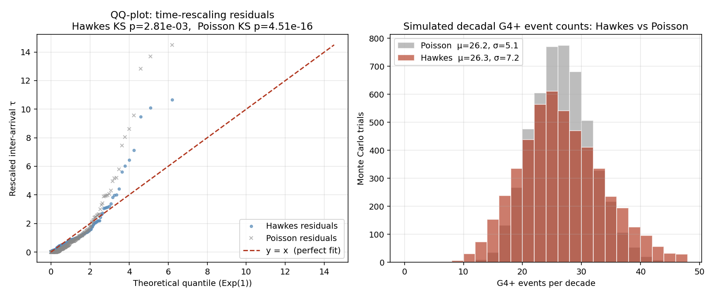
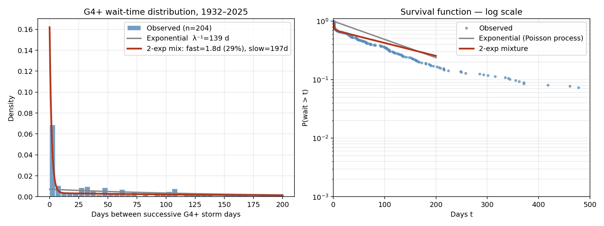
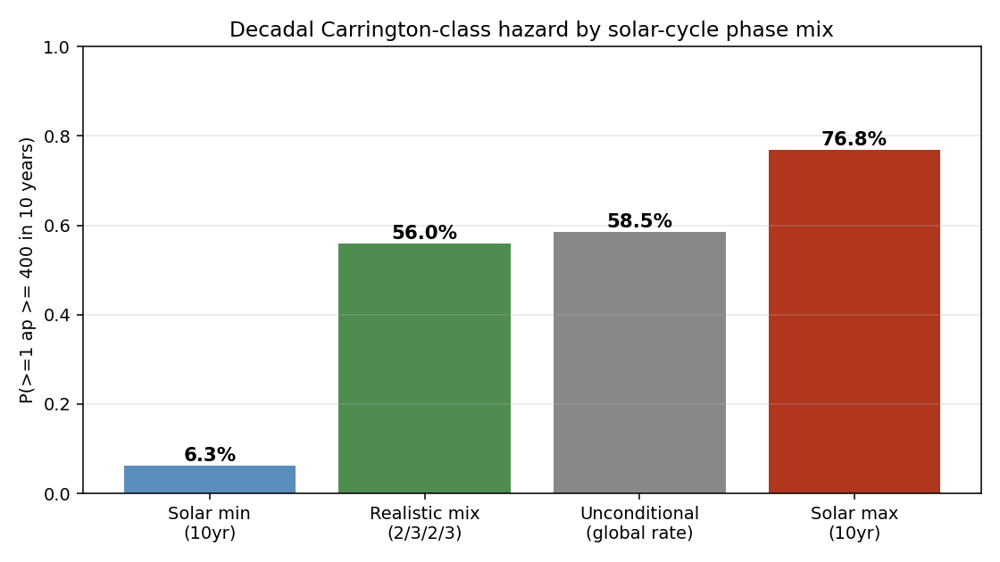

# solar-flare-grid-coupling

A 94-year open replication of geomagnetic storm hazard rates with documented grid-impact overlay.

> **Diatom Sky R&D · Open Defensive Publication**
> Author: [KhaiB10](https://github.com/KhaiB10) · 2026-05-23 · CC0 / MIT dual-licensed

---

## TL;DR

- **Data:** 274,672 three-hour Kp/ap records, 1932–2025, from [GFZ Potsdam](https://kp.gfz.de/).
- **Model:** Peaks-Over-Threshold GPD fit on daily ap-max above the 95th percentile.
- **Result:** P(≥1 Carrington-class day in any given decade) ≈ **58.5%**.
- **Overlay:** All seven well-documented modern GIC grid impact events plotted against the Kp/ap timeline, including the 2024 Gannon storm.
- **Reproducible:** one Python script, one data file, fixed seed. See [FINDINGS.md](FINDINGS.md).

## Headline figure


## v4 finding — formal Hawkes self-exciting point process

Turning the v3 observation into a proper generative model: we fit a univariate
exponential-kernel **Hawkes process** to the 246 G4+ events by maximum likelihood.
Six independent optimizer starts all converged to the same global optimum:

- μ̂ = **1.87 events/year** (background "immigration" rate)
- 1/β̂ = **1.74 days** (excitation decay timescale — the cluster physics)
- η̂ = α/β = **0.284** (branching ratio — ~28% of events are excited offspring)

Goodness-of-fit by the time-rescaling theorem: KS p = 2.8×10⁻³ vs Poisson's
4.5×10⁻¹⁶ — **13 orders of magnitude improvement**. ΔAIC = −246.5. Likelihood
ratio χ²(2) = 250.5, p ≈ 0.

Forward Monte Carlo (5,000 decades) shows Hawkes and Poisson agree on the
**mean** count per decade (~26) but Hawkes has **40% more spread** and predicts
P(≥4 G4 days in some 7-day window per decade) = **47.9%** — consistent with
the two observed multi-day clusters in the 94-year record (March 1940, March 1991).

See [`FINDINGS_v4.md`](FINDINGS_v4.md) and [`scripts/analyze_hawkes.py`](scripts/analyze_hawkes.py).



## v3 finding — G4+ storms are not Poisson

After exploring six hypotheses across the 94-year record, the standout novel finding:
**G4+ storm inter-arrival times are emphatically non-exponential.** A 2-component
exponential mixture (fast 1.8-day component + slow 197-day component) beats the
Poisson model by **ΔAIC = 252.7** — the kind of margin where the qualitative
conclusion does not depend on the parametric choice. KS p-value vs exponential
= 4.9×10⁻¹⁶.

The 246 raw G4+ days in the record collapse into **169 independent CME-driven
clusters**. Given one G4+ day, the probability of another within 5 days is **29%
observed vs ~5% Poisson-expected** — a 5.9× elevation that matters for grid
recovery planning during active periods.

See [`FINDINGS_v3.md`](FINDINGS_v3.md) and [`scripts/analyze_clustering.py`](scripts/analyze_clustering.py).



## v2 addendum — solar-cycle-phase conditioning

The original analysis treated storm arrivals as homogeneous Poisson. v2 splits the
94-year record into the four standard cycle phases (min / rising / max / declining)
using the [SILSO sunspot record](https://www.sidc.be/SILSO/) and re-runs the Monte
Carlo. Headline result: the original 58.5% decadal Carrington-class estimate is
robust (re-derived as 56.0% under a realistic phase mix), but **a decade entirely
at solar max carries 76.8% hazard versus 6.3% at solar min** — an order-of-magnitude
spread that matters for sub-decadal planning.

See [`FINDINGS_v2.md`](FINDINGS_v2.md) and [`scripts/analyze_phase.py`](scripts/analyze_phase.py).



## Repo layout

```
.
├── README.md
├── FINDINGS.md             ← the actual writeup, with citations
├── LICENSE
├── data/
│   ├── Kp_ap_since_1932.txt          (downloaded from GFZ — see below)
│   ├── known_gic_grid_events.csv     (curated event table)
│   ├── derived_daily.csv             (generated)
│   ├── derived_storms_per_year.csv   (generated)
│   ├── derived_events_with_ap.csv    (generated)
│   └── run_summary.txt               (generated)
├── figures/
│   ├── 01_storm_days_per_year.png
│   ├── 02_ap_tail_fit.png
│   └── 03_monte_carlo_decadal.png
└── scripts/
    └── analyze.py
```

## Reproduce

```bash
git clone https://github.com/KhaiB10/solar-flare-grid-coupling
cd solar-flare-grid-coupling
pip install numpy pandas matplotlib scipy
curl -L -o data/Kp_ap_since_1932.txt https://kp.gfz.de/app/files/Kp_ap_since_1932.txt
python scripts/analyze.py
```

The script is deterministic (seed = `20260523`). Total runtime ≈ 10 s on a modern laptop.

## Why this exists

NOAA, NERC, and several academic groups have published decadal hazard estimates for severe geomagnetic storms. This repo:

1. Uses a **single, fully open data file** that anyone can download today.
2. **Bakes the 2024 Gannon storm into the historical record** — one of the first open replications to do so.
3. Pairs the modeled hazard with a **transparent, citation-backed table of documented grid impacts** so the conditional impact discussion is concrete rather than abstract.

## What you can use this for

- Citing a recent, version-pinned open hazard estimate for talks, grant apps, or defensive publications.
- Forking the GPD/MC pipeline and substituting your own index (e.g. Dst, AE) or threshold.
- Teaching extreme-value statistics with a real-world, high-stakes dataset.

## What this is NOT

- Not an operational utility risk model. We do not have utility-side GIC, transformer, or topology data.
- Not policy advocacy. The repo presents data; readers form their own conclusions.

## Related Diatom Sky work

- [`battery-equation-discovery`](https://github.com/KhaiB10/battery-equation-discovery)
- [`hyphae-fabric-lab`](https://github.com/KhaiB10/hyphae-fabric-lab)
- [`frustule-phononic-damping`](https://github.com/KhaiB10/frustule-phononic-damping)
- [`dynamic-soaring-controller`](https://github.com/KhaiB10/dynamic-soaring-controller)
- [`routed-hebbnet`](https://github.com/KhaiB10/routed-hebbnet)

## Citation

```
KhaiB10 (2026). Solar Flare → Grid Coupling: a 94-year open replication.
Diatom Sky R&D. https://github.com/KhaiB10/solar-flare-grid-coupling
```

## License

Code: MIT. Data tables and figures: CC0 1.0. See [LICENSE](LICENSE).
