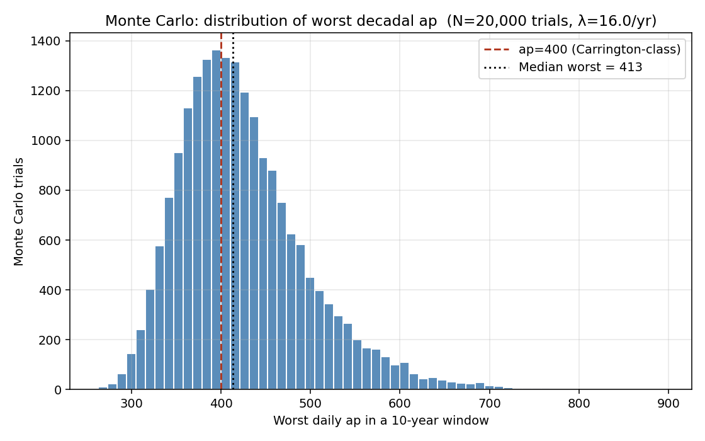

# solar-flare-grid-coupling

A 94-year open replication of geomagnetic storm hazard rates with documented grid-impact overlay.

> **Diatom Sky R&D · Open Defensive Publication**
> Author: [KhaiB10](https://github.com/KhaiB10) · 2026-05-23 · CC0 / MIT dual-licensed

---

## TL;DR

- **Data:** 274,672 three-hour Kp/ap records, 1932–2025, from [GFZ Potsdam](https://kp.gfz.de/).
- **Model:** Peaks-Over-Threshold GPD fit on daily ap-max above the 95th percentile.
- **Result:** P(≥1 Carrington-class day in any given decade) ≈ **58.5%**.
- **Overlay:** All seven well-documented modern GIC grid impact events plotted against the Kp/ap timeline, including the 2024 Gannon storm.
- **Reproducible:** one Python script, one data file, fixed seed. See [FINDINGS.md](FINDINGS.md).

## Headline figure



## Repo layout

```
.
├── README.md
├── FINDINGS.md             ← the actual writeup, with citations
├── LICENSE
├── data/
│   ├── Kp_ap_since_1932.txt          (downloaded from GFZ — see below)
│   ├── known_gic_grid_events.csv     (curated event table)
│   ├── derived_daily.csv             (generated)
│   ├── derived_storms_per_year.csv   (generated)
│   ├── derived_events_with_ap.csv    (generated)
│   └── run_summary.txt               (generated)
├── figures/
│   ├── 01_storm_days_per_year.png
│   ├── 02_ap_tail_fit.png
│   └── 03_monte_carlo_decadal.png
└── scripts/
    └── analyze.py
```

## Reproduce

```bash
git clone https://github.com/KhaiB10/solar-flare-grid-coupling
cd solar-flare-grid-coupling
pip install numpy pandas matplotlib scipy
curl -L -o data/Kp_ap_since_1932.txt https://kp.gfz.de/app/files/Kp_ap_since_1932.txt
python scripts/analyze.py
```

The script is deterministic (seed = `20260523`). Total runtime ≈ 10 s on a modern laptop.

## Why this exists

NOAA, NERC, and several academic groups have published decadal hazard estimates for severe geomagnetic storms. This repo:

1. Uses a **single, fully open data file** that anyone can download today.
2. **Bakes the 2024 Gannon storm into the historical record** — one of the first open replications to do so.
3. Pairs the modeled hazard with a **transparent, citation-backed table of documented grid impacts** so the conditional impact discussion is concrete rather than abstract.

## What you can use this for

- Citing a recent, version-pinned open hazard estimate for talks, grant apps, or defensive publications.
- Forking the GPD/MC pipeline and substituting your own index (e.g. Dst, AE) or threshold.
- Teaching extreme-value statistics with a real-world, high-stakes dataset.

## What this is NOT

- Not an operational utility risk model. We do not have utility-side GIC, transformer, or topology data.
- Not policy advocacy. The repo presents data; readers form their own conclusions.

## Related Diatom Sky work

- [`battery-equation-discovery`](https://github.com/KhaiB10/battery-equation-discovery)
- [`hyphae-fabric-lab`](https://github.com/KhaiB10/hyphae-fabric-lab)
- [`frustule-phononic-damping`](https://github.com/KhaiB10/frustule-phononic-damping)
- [`dynamic-soaring-controller`](https://github.com/KhaiB10/dynamic-soaring-controller)
- [`routed-hebbnet`](https://github.com/KhaiB10/routed-hebbnet)

## Citation

```
KhaiB10 (2026). Solar Flare → Grid Coupling: a 94-year open replication.
Diatom Sky R&D. https://github.com/KhaiB10/solar-flare-grid-coupling
```

## License

Code: MIT. Data tables and figures: CC0 1.0. See [LICENSE](LICENSE).
